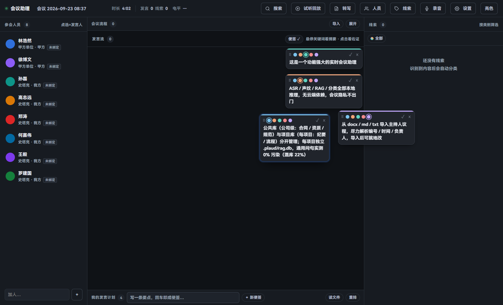

# 实时会议助理

**全本地 · 单进程 · 可切换 ASR 的实时会议助理**
*Real-time, fully-local meeting assistant.*

> 边开会边转写、边分人、边把"要求 / 承诺 / 风险"分好类、边检索当前项目的知识库。
> 所有推理都在本机完成——**会议内容不离开你的机器**。



授权：**AGPL-3.0 开源**——自用、内部使用、修改、再分发都免费；只有"作为网络服务对外提供"
或"闭源集成进对外销售的产品"这类用法才需要遵守 AGPL 的源码公开义务，不愿承担时可单独取得
**商业授权**（双授权）。详见 [协议](#协议) 与 [LICENSE](LICENSE)。

---

## 它是什么

一个**实时**（而非事后批处理）的会议助理。打开就是浏览器三栏工作台：

| 栏 | 回答什么 |
|---|---|
| **左 · 参会人员** | 屋里是谁（声纹绑定：点一下 = 署名 + 登记声纹） |
| **中 · 发言流** | 刚说了什么（关键词下划线，悬停出摘要、点击出佐证） |
| **右 · 线索** | 哪句要紧、依据是什么（每条线索带来源发言可回溯） |

麦克风边说边转写，同时并行做三件事：**声纹分人 → 线索分类 → 项目知识库检索**；
句尾后约 0.5–1s 出定稿文本与检索结果。会后可把纪要批量导入**事件表**，做聚合与跨会议遍历。

---

## 核心优势

| # | 优势 | 说明 |
|---|---|---|
| 1 | **全本地、数据不出机** | ASR / 声纹 / RAG / 分类全部本地推理，无云端依赖，会议隐私不出门 |
| 2 | **实时，不是批处理** | 边说边转写、边分类、边检索；句尾后 ~0.5–1s 出结果 |
| 3 | **单进程、开箱即用** | 界面 + 音频 + 检索同进程；双击原生 exe 或一条命令即开，无服务编排 |
| 4 | **可切换 ASR 引擎** | FunASR（GGUF，RTF≈0.027）与 FireRedASR2S（CER 3.05% + BERT 标点）一键切换 |
| 5 | **轻量嵌入、零 torch** | bge-small-zh ONNX INT8（23.9MB / 512 维），RAG 路径不加载 torch/transformers；冷启动 0.96s、热查询 4.4ms |
| 6 | **分库隔离、零跨项目污染** | 公共库（公司级：合同 / 资质 / 规范）与项目库（每项目：纪要 / 流程）分开管理；每项目独立 `.plaud/rag.db`，通用问句实测 0% 污染（混库 22%） |
| 7 | **声纹分人（闭集）** | CAM++ 192 维；会前名单 + 用户点名绑定，把"开集"降级为"验证"，比在线聚类可靠 |
| 8 | **线索分类（10 类闭集）** | 规则 + LLM 双通道；甲方要求 / 我方承诺 / 风险 / 决策…每条带来源发言 |
| 9 | **事件表** | 纪要 → 平铺事件表，支持聚合（"甲方提了多少项要求"）与跨会议遍历（"某事怎么变的"） |
| 10 | **Obsidian 导出** | 会话纪要导出为带 `[[wikilink]]` 的 Markdown，实体归一、不碎片化 |
| 11 | **会议流程导入** | 从 docx / md / txt 导入主持人议程，尽力解析编号 / 时间 / 负责人，导入后可就地改 |
| 12 | **按项目文件夹组织** | 计划 + 导入资料 + 知识库 + 声纹随项目走，跨会可检索、可在 Obsidian 版本管理 |
| 13 | **发言计划真文件 + 标签** | `<项目>/发言计划.md` 可直接编辑；每条带类别色标（悬停见名），专门编辑器一键设置 |
| 14 | **钉为参考** | 把检索依据（合同条款等）钉到计划项，只存证据、不替你写话术 |

---

## 功能一览

- **音频采集** — 本机麦克风（默认设备，或 `--mic DEV` 指定；带自动增益）；无麦克风时可用界面右上角「试听回放」喂一个 WAV 走完整链路
- **流式 ASR（可切换）**
  - `funasr`：FunASR 官方 GGUF 运行时（SenseVoice / Paraformer 各 ~230MB），CPU 即可，RTF≈0.027
  - `firered`：FireRedASR2S（AED + Stream-VAD + BERT 标点），CER 3.05%，建议 torch + GPU
- **声纹分人** — CAM++ 192 维嵌入；闭集方案（名单 + 点名绑定），一次点击完成署名与声纹登记
- **线索分类** — 规则通道（快、可离线）+ LLM 通道（准），10 类闭集；每条线索强制带 `seg_id` 来源
- **项目 RAG（实时关键词检索）** — SQLite FTS5（jieba 中文分词）+ sqlite-vec 向量，RRF 融合；bge-small-zh ONNX INT8 嵌入；实时从识别文字抽取关键词做按需检索（9–11ms）；每项目独立库，0% 跨项目污染
- **会议流程导入** — 从 docx / md / txt 导入主持人议程，尽力解析编号 / 时间槽 / 负责人 / 备注，导入后可双击改名、回车新增
- **按项目文件夹组织** — 每个项目一个文件夹：`发言计划.md` + `导入/` 资料 + `.plaud/`（知识库 + 跨会声纹）；随项目走、跨会可检索、可在 Obsidian 版本管理
- **公司 / 项目文档分库** — 公共库（合同 / 资质 / 规范，公司级共享）与项目库（会议纪要 / 流程，每项目独立）分开管理，避免跨项目混乱
- **发言计划（真文件 + 标签）** — `<项目>/发言计划.md` 可直接在 Obsidian 编辑；每条带类别色标（议题 / 风险 / …，悬停见名），专门标签编辑器（`Alt+L`）一键设置，标签随文件保存
- **钉为参考** — 把检索到的依据（合同条款等）钉到发言计划项上，只存证据（标题 + 片段 + 相关度）、不替你写话术
- **事件抽取** — 纪要 → 事件表（类型 / 内容 / 期限 / 责任人），支持 `aggregate`（聚合）与 `timeline`（遍历）
- **热词** — 会话级热词表，治人名 / 公司名同音错
- **首次打开的使用引导** — 界面第一次打开自动走一遍六步引导（录音 → 发言流 → 线索 → 便签 → 导入 → 设置），之后从 `设置 → 界面` 可随时再看
- **Obsidian 导出** — 带 `[[wikilink]]` 的 Markdown，实体归一、0 断链（独立脚本 `scripts/export_obsidian.py` / `export_minutes.py`，不是界面按钮、也没有 HTTP 接口）

---

## 架构

```
原生启动器 exe (pywebview, 无 torch, 无控制台)
    │  双击即用：窗口就绪后才显示，第一眼就是会议界面；关窗即停服务
    └─ 子进程: venv python -m meeting.server --managed  （UI + 音频 + 检索 单进程）
              ├─ 音频源: 本机麦克风  → 重采样 16k
              ├─ 流式 ASR (可切换)
              │    funasr: SenseVoice / Paraformer (GGUF)
              │    firered: AED + Stream-VAD + BERT 标点
              │            → 句尾定稿 + 时间戳
              ├─ 声纹分人 (CAM++, 闭集: 名单 + 点名绑定)
              ├─ 线索分类 (规则 + LLM, 10 类闭集)
              └─ 项目 RAG (FTS5+jieba + sqlite-vec + bge-small-zh ONNX INT8, RRF)
                     每项目独立 .plaud/rag.db, 0% 跨项目污染
```

---

## 快速开始

**方式 A · 原生启动器（推荐）**

```
1. 构建:  launcher\build_launcher.ps1      （产出 MeetingLauncher.exe，无控制台）
2. 双击 MeetingLauncher.exe
3. 窗口先隐藏创建，后端就绪（实测 3–6s）后直接显示会议界面——没有首页、不用点"启动"，
   也看不到加载页（它只在启动慢或起不来时出现，那时上面的进度/日志才有用）
```

> 启动器是"薄"的：只做窗口 + 子进程编排，不加载任何模型（不 import torch）。
> 它会自动定位仓库根（含 `venv/` 的目录），用 venv 的 python 以
> `CREATE_NO_WINDOW` 拉起 `meeting.server`（不会冒出命令行窗口）。
>
> - **开箱即加载**：按 `config/settings.json` 的 `asr.engine` 加载识别模型；
>   同时挂上设置里的**公共库**（`corpora.public_db` / `public_kb`，索引不存在就新建），
>   嵌入模型在启动时预热，右栏检索与「导入」直接可用。
> - **换引擎**：进界面后打开「设置」→ 识别与模型 → 保存，再点设置页里的
>   **「重启服务」**（启动器会把后端重启一遍，端口不变，界面自动接上）。
> - **关闭窗口 = 停服务**：识别模型与嵌入模型都在那个子进程里，一起退出，不留后台。
> - 端口默认 8510；被别的服务占着会自动顺延（界面上没有端口可填，所以它自己找）。

**方式 B · PowerShell**

```powershell
git clone https://github.com/aihaili/meeting-assistant.git
cd meeting-assistant
.\run_meeting.ps1                 # 默认 HTTP 8510, 本机麦克风
# 浏览器打开 http://127.0.0.1:8510/

# 可选参数:
#   -NoLlm       只用规则分类（更快、可离线）
#   -NoAsr       不起音频接收，只看界面
#   -Port 8500   换端口
#   -Session data\sessions\demo.json   打开已有会话
```

> 没有麦克风？起服务后点界面右上角「试听回放」，填一个 WAV 路径即可走完整链路。
> 想要"只加载界面不加载模型"：`python -m meeting.server --no-asr --no-rag`。

> **要看实现**：`docs/FEATURES-AND-IMPLEMENTATION.md` 是当前的《功能与实现总结》——每个功能落到哪个文件/类/参数、端到端数据流、关键取舍、已知限制。

---

## 前置条件

| 项 | 说明 |
|---|---|
| **OS** | Windows 10/11 |
| **Python** | 3.12（需自建 `venv`，装 torch / funasr / onnxruntime 等，见 `requirements.txt`） |
| **GPU** | 可选。CUDA 加速 ASR（`firered` 需要）；`funasr` CPU 也可跑 |
| **LLM** | 可选。本地 llama.cpp（OpenAI 兼容接口），用于线索分类 + 关键词抽取；`--no-llm` 可完全离线 |
| **ASR 模型** | 不随仓库提供。`funasr`：FunASR 官方 GGUF 运行时 + 模型；`firered`：FireRedASR2S（含 AED / VAD / Punc） |

> 仓库里**不含**任何模型权重与 `venv`。代码里的默认路径（`E:\models\gguf-asr`、
> `E:\WhisperX\FireRedASR2S` 等）是按开发机布局写死的，换机器请在
> `config/settings.json` 与 `scripts/meeting/settings.py` 的 `SCHEMA` 默认值里改掉。

---

## 配置

`config/settings.json`（优先级：命令行参数 > settings.json > 环境变量（含 `config/.env`）> 内置默认）：

```jsonc
{
  "llm": {
    "provider": "openai",
    "base_url": "http://127.0.0.1:8080/v1",
    "model": "<你的本地 LLM 模型路径>",
    "no_think": true
  },
  "embedding": { "backend": "bge-small-zh" },   // 多语言切 "bge-m3" 后需重建索引
  "asr": {
    "engine": "funasr",                          // "funasr" | "firered"
    "model_dir": "<FunASR GGUF 目录>",
    "firered_dir": "<FireRedASR2S 目录>",
    "device": "cuda:0",                           // 无 GPU 改 "cpu"
    "hotwords": true
  },
  "corpora": {
    "public_kb": "<公共资料库目录>",             // 公司级、多项目共享
    "project_db": ""                               // 留空 = 用项目内 .plaud/rag.db
  }
}
```

> 上例路径是占位——把 `<...>` 换成你机器上的实际路径即可。

---

## 目录结构

```
launcher/       原生启动器（pywebview，薄，无 torch；打开即进界面，关窗即停服务）
scripts/
  meeting/      实时会议助理（server / session / classify / voiceprints / planfile / outline / settings / ui.html）
  phone_mic/    音频链路（mic_source / streaming / stream_asr / firered_asr / hotwords）
  rag/          混合检索（rag_core / embedder / chunking / ingest / sync / events / selftest）
  asst/         早期极简助理核心（meeting 复用其 Assistant）
  llm_client.py 共享 LLM 层
config/         settings.json
data/           会话/测试数据（gitignore）
```

---

## 性能（开发机实测）

| 环节 | 实测 |
|---|---|
| ASR（FunASR GGUF，CPU） | 3 分钟音频 ~5s（RTF≈0.027） |
| ASR（FireRedASR2S） | CER 3.05%（含 BERT 标点） |
| 嵌入（bge-small-zh ONNX INT8） | 冷启动 0.96s / 热查询 4.4ms / 0 GPU |
| 整段检索 | 16–18ms |
| 关键词按需检索 | 9–11ms |
| 音频 → 检索 端到端 | 句尾后 ~0.5–1s |
| 项目索引（增量） | 首次 0.96s / 再启动 0.095s |
| RAG 命中（hybrid） | hit@3 15/15、top-1 15/15 |

---

## 已知限制（诚实清单）

- **文档格式**：**知识库索引只吃 Markdown**（PDF / XLSX / PPTX 解析库未内置，建议先用 LLM 把文档转成 Markdown 再入库，实测优于专业 OCR）。`.docx` 只有**议程导入**那条路能解析，且它只解析进会话、不进索引
- **无文件监听**：项目索引只在启动时同步一次；会议中新增文件需重启或手动 `python -m rag.sync`
- **LLM 依赖**：线索分类的 LLM 通道需要本地 LLM；`--no-llm` 走规则通道（快、可离线，但偏保守）
- **声纹闭集**：说话人须会前在名单中；完全陌生的人需临时点名绑定
- **Obsidian 导出为一次性**：尚无"边开会边增量更新 vault"
- **Windows 限定**：启动器（pywebview）、部分路径默认值与实测都在 Windows 上；核心服务理论上可跨平台，但未验证

---

## 协议

**[GNU AGPL-3.0](https://www.gnu.org/licenses/agpl-3.0.html)（AGPL 第 3 版或更新）** —— 许可证全文见 [LICENSE](LICENSE)，
版权与双授权声明见 [NOTICE](NOTICE)。

一句话说清：

- **免费**：自己用、公司/组织**内部**用、修改、再分发都免费——只要遵守 AGPL。
- **要留意的只有一种情况**：把它（或改过的版本）**作为网络服务对外提供**时，AGPL 第 13 条要求你
  向使用者提供对应源码；把它闭源集成进对外销售的产品同理。
- **不想承担这个义务**（闭源集成、对外 SaaS 但不愿开源改动、需要免责或支持条款等）→ 可以单独
  取得**商业授权**，这就是常见的双授权模式。

> 商业授权 / 合作洽谈：在 <https://github.com/aihaili/meeting-assistant/issues> 开一个 Issue，
> 或通过 GitHub 联系 [@aihaili](https://github.com/aihaili)。

### 第三方组件与模型

本仓库不分发模型权重。运行时依赖的 FunASR、FireRedASR2S、CAM++、bge 系列嵌入模型、
pywebview、sqlite-vec、jieba、ONNX Runtime 等各自遵循其原始许可（MIT / Apache-2.0 / BSD 等），
使用与再分发前请逐一确认其条款。
