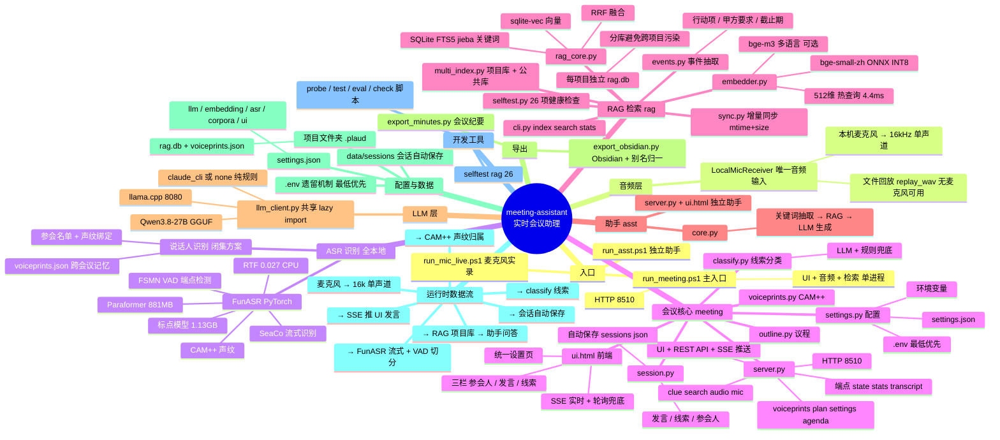

# 架构思维导图（Mermaid）

> 离线可看：VS Code（Mermaid 预览）/ Obsidian / GitHub / Typora 直接渲染。
> 交互版（可缩放、折叠）见 `architecture-mindmap.html`（需联网加载 markmap）。
> 生成日期：2026-09-19，对应 git `1ccfc00` 之后的代码状态。

```mermaid
mindmap
  root((meeting-assistant<br/>实时会议助理))
    入口
      run_meeting.ps1 主入口
        UI + 音频 + 检索 单进程
        HTTP 8510
      run_mic_live.ps1 麦克风实录
      run_asst.ps1 独立助手
    音频层
      LocalMicReceiver 唯一音频输入
        本机麦克风 → 16kHz 单声道
        文件回放 replay_wav 无麦克风可用
    ASR 识别 全本地
      FunASR PyTorch
        Paraformer 881MB
        标点模型 1.13GB
        FSMN VAD 端点检测
        SeaCo 流式识别
        CAM++ 声纹
        RTF 0.027 CPU
      说话人识别 闭集方案
        参会名单 + 声纹绑定
        voiceprints.json 跨会议记忆
    会议核心 meeting
      server.py
        HTTP 8510
        UI + REST API + SSE 推送
        端点 state stats transcript
        clue search audio mic
        voiceprints plan settings agenda
      session.py
        发言 / 线索 / 参会人
        自动保存 sessions json
      classify.py 线索分类
        LLM + 规则兜底
      outline.py 议程
      settings.py 配置
        .env 最低优先
        环境变量
        settings.json
      voiceprints.py CAM++
      ui.html 前端
        三栏 参会人 / 发言 / 线索
        SSE 实时 + 轮询兜底
        统一设置页
    RAG 检索 rag
      rag_core.py
        SQLite FTS5 jieba 关键词
        sqlite-vec 向量
        RRF 融合
      embedder.py
        bge-small-zh ONNX INT8
        512维 热查询 4.4ms
        bge-m3 多语言 可选
      multi_index.py 项目库 + 公共库
      sync.py 增量同步 mtime+size
      每项目独立 rag.db
        分库避免跨项目污染
      events.py 事件抽取
        行动项 / 甲方要求 / 截止期
      cli.py index search stats
      selftest.py 26 项健康检查
    助手 asst
      core.py
        关键词抽取 → RAG → LLM 生成
      server.py + ui.html 独立助手
    LLM 层
      llm_client.py 共享 lazy import
        llama.cpp 8080
        Qwen3.8-27B GGUF
        claude_cli 或 none 纯规则
    导出
      export_minutes.py 会议纪要
      export_obsidian.py Obsidian + 别名归一
    配置与数据
      settings.json
        llm / embedding / asr / corpora / ui
      .env 遗留机制 最低优先
      data/sessions 会话自动保存
      项目文件夹 .plaud
        rag.db + voiceprints.json
    运行时数据流
      麦克风 → 16k 单声道
      → FunASR 流式 + VAD 切分
      → SSE 推 UI 发言
      → classify 线索
      → CAM++ 声纹归属
      → RAG 项目库 → 助手问答
      → 会话自动保存
    开发工具
      probe / test / eval / check 脚本
      selftest rag 26
```
